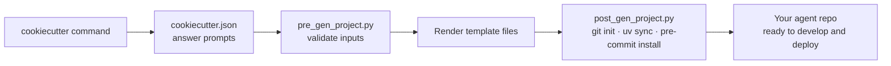
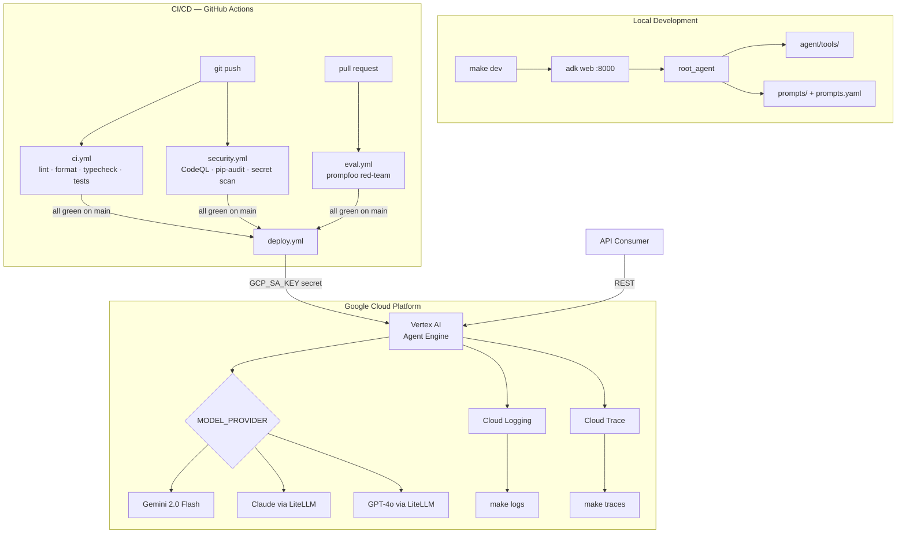

# ADK Agent Deployment Template

A professional [cookiecutter](https://cookiecutter.readthedocs.io) template for deploying [Google ADK](https://google.github.io/adk-docs/) agents to [Vertex AI Agent Engine](https://cloud.google.com/vertex-ai/docs/agents/overview). Clone once, generate a new agent project in seconds, deploy to GCP in under 30 minutes.

## What you get

Running `cookiecutter` against this template generates a fully configured Python repository with:

- Google ADK `root_agent` that runs out of the box with `make dev`
- Structured prompt system — compose prompts from `.md` files via a YAML registry
- Multi-provider model support: Gemini, Claude (via LiteLLM), GPT-4o (via LiteLLM)
- One-command deploy to Vertex AI Agent Engine (`make deploy-prod`)
- GitHub Actions: CI, security audit, prompt red-team eval, and deployment
- Pre-commit hooks: ruff, pyright, detect-secrets, markdownlint, commitizen
- Promptfoo red-team evaluation suite (prompt injection, jailbreak, PII tests)
- Cloud Logging and Cloud Trace integration via `make logs` / `make traces`
- `CLAUDE.md` with full AI assistant instructions for ongoing development
- `.claude/commands/` slash commands: `/deploy`, `/eval`, `/logs`

## Prerequisites

- Python 3.11+
- [uv](https://docs.astral.sh/uv/) — `curl -LsSf https://astral.sh/uv/install.sh | sh`
- Node.js 20+ (for promptfoo)
- [gcloud CLI](https://cloud.google.com/sdk/docs/install) (for deployment)
- [cruft](https://cruft.github.io/cruft/) — `pip install cruft` (wraps cookiecutter and tracks
  the template version so you can pull in updates later; plain
  `pip install cookiecutter` also works if you don't need update tracking)

## Quickstart

```bash
# 1. Generate your agent project (cruft is the canonical way — it records
#    which template commit you generated from, in .cruft.json)
cruft create gh:your-org/agent-deployment-template

# 2. Enter the generated project
cd your-agent-name

# 3. Configure environment
cp .env.example .env
# Edit .env — fill in GOOGLE_CLOUD_PROJECT and GOOGLE_API_KEY at minimum

# 4. Run locally
make dev   # → http://localhost:8000
```

### Keeping a generated project in sync with the template

Every generated project has a `.cruft.json` pinning the template commit it was
created from. When the template gains new features or fixes, pull them into
your project:

```bash
cruft check    # is this project behind the template?
cruft update   # apply the diff — resolve conflicts like a merge
```

## Generation flow



## Generated repo architecture



## Cookiecutter variables

| Variable | Default | Description |
|---|---|---|
| `project_name` | `My ADK Agent` | Human-readable project name |
| `project_slug` | auto from name | Directory name and Python package name |
| `project_description` | — | One-line description |
| `author_name` | — | Your name |
| `author_email` | — | Your email |
| `github_org` | `your-org` | GitHub organisation |
| `gcp_project_id` | `my-gcp-project` | GCP project ID (update in `.env`) |
| `gcp_location` | `europe-west1` | Vertex AI region |
| `model_provider` | `google` | Default model provider |
| `python_version` | `3.11` | Python version |
| `open_source_license` | `MIT` | License type (`MIT`, `Apache-2.0`, `Proprietary`) |

## Contributing to the template

See [CLAUDE.md](CLAUDE.md) for contributor instructions (also read automatically by AI assistants).

```bash
make install    # install template dev dependencies
make validate   # generate test project and run its tests
make pre-commit # run all hooks
```
