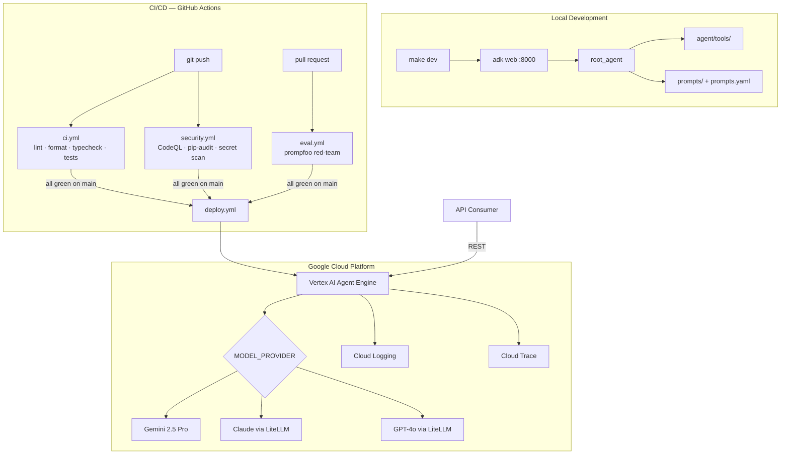

# {{cookiecutter.project_name}}

{{cookiecutter.project_description}}

Built with [Google ADK](https://google.github.io/adk-docs/) and deployed on [Vertex AI Agent Engine](https://cloud.google.com/vertex-ai/docs/agents/overview).

## Architecture


```mermaid
flowchart TD
    subgraph local["Local Development"]
        DEV[make dev] --> ADK[adk web :8000]
        ADK --> ROOT[root_agent]
        ROOT --> TOOLS[agent/tools/]
        ROOT --> PROMPTS[prompts/ + prompts.yaml]
    end

    subgraph ci["CI/CD — GitHub Actions"]
        PUSH[git push] --> CI[ci.yml\nlint · format · typecheck · tests]
        PUSH --> SEC[security.yml\nCodeQL · pip-audit · secret scan]
        PR[pull request] --> EVAL[eval.yml\nprompfoo red-team]
        CI & SEC & EVAL -->|all green on main| DEPLOY[deploy.yml]
    end

    subgraph gcp["Google Cloud Platform"]
        DEPLOY --> ENGINE[Vertex AI Agent Engine]
        ENGINE --> MODEL{MODEL_PROVIDER}
        MODEL --> G[Gemini 2.5 Pro]
        MODEL --> CL[Claude via LiteLLM]
        MODEL --> OAI[GPT-4o via LiteLLM]
        ENGINE --> LOG[Cloud Logging]
        ENGINE --> TRACE[Cloud Trace]
    end

    CLIENT[API Consumer] -->|REST| ENGINE
```

## Quickstart

### Prerequisites

- Python {{cookiecutter.python_version}}+, [uv](https://docs.astral.sh/uv/), Node.js 20+
- [gcloud CLI](https://cloud.google.com/sdk/docs/install) authenticated

### Local development

```bash
make install              # install dependencies
cp .env.example .env      # configure environment variables
make dev                  # run at http://localhost:8000
```

### Run tests

```bash
make test                 # unit tests with coverage
make eval                 # promptfoo red-team evaluation
```

### Deploy to GCP

```bash
make setup-gcp ENV=dev    # one-time GCP bootstrap for the dev project (creates SA, bucket, key)
make setup-gcp ENV=prod   # same, for the prod project (ENV defaults to prod if omitted)
make deploy-dev           # deploy to dev Agent Engine resource
make deploy-prod          # deploy to prod
```

`dev` and `prod` deploy via separate GitHub Environments with their own secrets and variables —
see [Required GitHub Environments](CLAUDE.md#required-github-environments) in `CLAUDE.md` for
exactly what to configure and where `setup-gcp`'s output goes.

## Make targets

| Target | Description |
|---|---|
| `make dev` | Run agent locally at http://localhost:8000 |
| `make test` | Unit tests with coverage |
| `make eval` | Prompt security evaluation (promptfoo) |
| `make lint` | Ruff lint check |
| `make format` | Ruff formatter |
| `make typecheck` | Pyright |
| `make deploy-dev` | Deploy to Agent Engine (dev) |
| `make deploy-prod` | Deploy to Agent Engine (prod) |
| `make rollback REF=<tag> [ENV=prod\|dev]` | Redeploy a previous git ref against the existing Agent Engine resource |
| `make health-check` | Standalone smoke test against the deployed Agent Engine resource (no fresh deploy) |
| `make logs` | Stream Cloud Logging |
| `make traces` | Open Cloud Trace in browser |
| `make setup-gcp [ENV=dev\|prod]` | One-time GCP bootstrap (default: prod) |
| `make pre-commit` | Run all pre-commit hooks |

## Environment variables

| Variable | Required | Description |
|---|---|---|
| `GOOGLE_CLOUD_PROJECT` | Deploy | GCP project ID |
| `GOOGLE_CLOUD_LOCATION` | Deploy | Vertex AI region (default: `us-central1`) |
| `GCS_STAGING_BUCKET` | Deploy | GCS bucket for Agent Engine artefacts |
| `AGENT_ENGINE_RESOURCE_NAME` | No | Existing resource to update (omit = create new) |
| `MODEL_PROVIDER` | No | `google` \| `anthropic` \| `openai` \| `litellm` |
| `GOOGLE_API_KEY` | Local dev | Not needed on GCP (uses ADC) |
| `ANTHROPIC_API_KEY` | If provider=anthropic | |
| `OPENAI_API_KEY` | If provider=openai | |
| `SERPAPI_API_KEY` | No | Enables live web search; omit for stub |

## Model providers

Set `MODEL_PROVIDER` in `.env`:

| Value | Model |
|---|---|
| `google` (default) | Gemini 2.5 Pro |
| `anthropic` | Claude Opus 4.8 via LiteLLM |
| `openai` | GPT-4o via LiteLLM |
| `litellm` | Any model — set `LITELLM_MODEL` |

## Logging and traces

```bash
make logs     # stream Cloud Logging (requires GOOGLE_CLOUD_PROJECT in .env)
make traces   # open Cloud Trace console in browser
```

Agent Engine emits traces and structured logs automatically — no instrumentation needed.

## Security

Prompt injection, jailbreak, and PII tests run automatically on every PR via [promptfoo](https://promptfoo.dev). Add test cases in `tests/evals/promptfoo.yaml`. See [SECURITY.md](SECURITY.md) for the vulnerability disclosure policy.

## Contributing

See [CONTRIBUTING.md](CONTRIBUTING.md). AI assistants: read [CLAUDE.md](CLAUDE.md) for full project context and working instructions.
