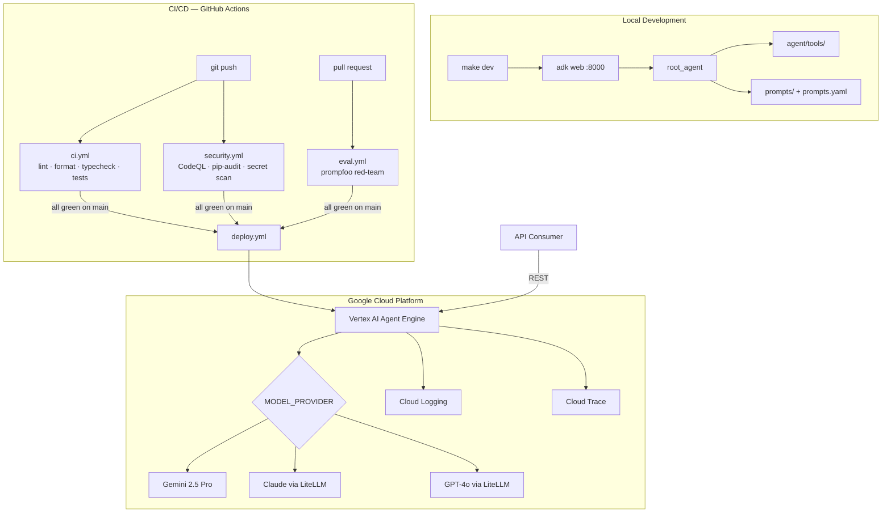

# {{cookiecutter.project_name}}

{{cookiecutter.project_description}}

Built with [Google ADK](https://google.github.io/adk-docs/) and deployed on [Vertex AI Agent Engine](https://cloud.google.com/vertex-ai/docs/agents/overview).

## Architecture


```mermaid
flowchart TD
    subgraph local["Local Development"]
        DEV[make dev] --> ADK[adk web :8000]
        ADK --> ROOT[root_agent]
        ROOT --> TOOLS[agent/tools/]
        ROOT --> PROMPTS[prompts/ + prompts.yaml]
    end

    subgraph ci["CI/CD — GitHub Actions"]
        PUSH[git push] --> CI[ci.yml\nlint · format · typecheck · tests]
        PUSH --> SEC[security.yml\nCodeQL · pip-audit · secret scan]
        PR[pull request] --> EVAL[eval.yml\nprompfoo red-team]
        CI & SEC & EVAL -->|all green on main| DEPLOY[deploy.yml]
    end

    subgraph gcp["Google Cloud Platform"]
        DEPLOY --> ENGINE[Vertex AI Agent Engine]
        ENGINE --> MODEL{MODEL_PROVIDER}
        MODEL --> G[Gemini 2.5 Pro]
        MODEL --> CL[Claude via LiteLLM]
        MODEL --> OAI[GPT-4o via LiteLLM]
        ENGINE --> LOG[Cloud Logging]
        ENGINE --> TRACE[Cloud Trace]
    end

    CLIENT[API Consumer] -->|REST| ENGINE
```

## Quickstart

### Prerequisites

- Python {{cookiecutter.python_version}}+, [uv](https://docs.astral.sh/uv/), Node.js 20+
- [gcloud CLI](https://cloud.google.com/sdk/docs/install) authenticated

### Local development

```bash
make install              # install dependencies
cp .env.example .env      # configure environment variables
make dev                  # run at http://localhost:8000
```

### Run tests

```bash
make test                 # unit tests with coverage
make eval                 # promptfoo red-team evaluation
```

### Deploy to GCP

Deploying from your machine needs both `gcloud` credential stores: the CLI login and
Application Default Credentials. `gcloud auth login` does **not** refresh ADC, and
`vertexai.init()` reads ADC — with only the first, a deploy fails partway with a
`RefreshError`.

```bash
gcloud auth login
gcloud auth application-default login

make setup-gcp ENV=dev    # one-time GCP bootstrap for the dev project (creates SA, bucket, key)
make setup-gcp ENV=prod   # same, for the prod project (ENV defaults to prod if omitted)
make deploy-dev           # deploy to dev Agent Engine resource
make deploy-prod          # deploy to prod
```

`dev` and `prod` deploy via separate GitHub Environments with their own secrets and variables —
see [Required GitHub Environments](CLAUDE.md#required-github-environments) in `CLAUDE.md` for
exactly what to configure and where `setup-gcp`'s output goes.

## Make targets

| Target | Description |
|---|---|
| `make dev` | Run agent locally at http://localhost:8000 |
| `make test` | Unit tests with coverage |
| `make eval` | Prompt security evaluation (promptfoo) |
| `make lint` | Ruff lint check |
| `make format` | Ruff formatter |
| `make typecheck` | Pyright |
| `make deploy-dev` | Deploy to Agent Engine (dev) |
| `make deploy-prod` | Deploy to Agent Engine (prod) |
| `make rollback REF=<tag> [ENV=prod\|dev]` | Redeploy a previous git ref against the existing Agent Engine resource |
| `make health-check` | Standalone smoke test against the deployed Agent Engine resource (no fresh deploy) |
| `make logs` | Stream Cloud Logging |
| `make traces` | List this agent's Cloud Trace spans |
| `make setup-gcp [ENV=dev\|prod]` | One-time GCP bootstrap (default: prod) |
| `make setup-monitoring` | One-time Cloud Monitoring dashboard + alert policy bootstrap |
| `make pre-commit` | Run all pre-commit hooks |

## Environment variables

| Variable | Required | Description |
|---|---|---|
| `GOOGLE_CLOUD_PROJECT` | Deploy | GCP project ID |
| `GOOGLE_CLOUD_LOCATION` | Deploy | Vertex AI region (default: `europe-west1`) |
| `GCS_STAGING_BUCKET` | No | Defaults to `gs://$GOOGLE_CLOUD_PROJECT-agent-staging`; `gs://` optional |
| `AGENT_ENGINE_RESOURCE_NAME` | No | Existing resource to update (omit = create new) |
| `AGENT_ENGINE_SERVICE_ACCOUNT` | No | Defaults to `agent-engine-sa@$GOOGLE_CLOUD_PROJECT…`; override only if renamed |
| `MODEL_PROVIDER` | No | `google` \| `anthropic` \| `openai` \| `litellm` |
| `CLOUD_TRACE_ENABLED` | No | Export a Cloud Trace span per tool call. Set automatically on deploy; off locally |
| `OTEL_EXPORTER_GCP_TRACE_PROJECT_ID` | With tracing | Project the exporter writes to; set automatically on deploy |
| `GOOGLE_API_KEY` | Local dev | Not needed on GCP (uses ADC) |
| `ANTHROPIC_API_KEY` | If provider=anthropic | |
| `OPENAI_API_KEY` | If provider=openai | |
| `SERPAPI_API_KEY` | No | Enables live web search; omit for stub |

## Model providers

Set `MODEL_PROVIDER` in `.env`:

| Value | Model |
|---|---|
| `google` (default) | Gemini 2.5 Pro |
| `anthropic` | Claude Opus 4.8 via LiteLLM |
| `openai` | GPT-4o via LiteLLM |
| `litellm` | Any model — set `LITELLM_MODEL` |

## Logging and traces

```bash
make logs     # read this agent's Cloud Logging entries (requires GOOGLE_CLOUD_PROJECT in .env)
make traces   # list this agent's Cloud Trace spans
```

`agent/observability.py` emits structured JSON events (tool calls, token usage) via
`log_event`/`@instrument`, and a Cloud Trace span per instrumented call.

Logs need no setup: Agent Engine forwards container stdout to Cloud Logging under
`aiplatform.googleapis.com/reasoning_engine_stdout`, parsing each JSON line into a structured
`jsonPayload`. Tracing does — `deployment/deploy.py` enables it on the deployed agent via
`CLOUD_TRACE_ENABLED` and `OTEL_EXPORTER_GCP_TRACE_PROJECT_ID`. It is off by default locally, so
`make dev` just prints to stdout.

**If logs seem missing, check the project's log sink before suspecting the agent.** A disabled
`_Default` sink discards every non-audit entry regardless of how it was written:

```bash
gcloud logging sinks describe _Default --project=$GOOGLE_CLOUD_PROJECT
```

See [Observability](CLAUDE.md#observability) in `CLAUDE.md` for the field reference.

### Cloud Logging query examples

Run these in [Logs Explorer](https://console.cloud.google.com/logs) or via `gcloud logging read`.
Agent Engine writes every reasoning engine's output to a shared pair of log names, so scope by
`reasoning_engine_id` to isolate one agent — `jsonPayload.agent_name` is `root_agent` in every
project generated from this template and cannot tell them apart:

```bash
ENGINE_ID=$(cat .agent_engine_resource | sed 's#.*/##')
STDOUT='logName="projects/'$GOOGLE_CLOUD_PROJECT'/logs/aiplatform.googleapis.com%2Freasoning_engine_stdout"'

# Every structured event this agent emits
gcloud logging read "$STDOUT AND resource.labels.reasoning_engine_id=\"$ENGINE_ID\"" --project=$GOOGLE_CLOUD_PROJECT --limit=50

# A specific tool's calls (start/end/error events all share its name as a prefix)
gcloud logging read "$STDOUT AND jsonPayload.event=~\"^web_search\.\"" --project=$GOOGLE_CLOUD_PROJECT

# Token usage per request
gcloud logging read "$STDOUT AND jsonPayload.event=\"model.usage\"" --project=$GOOGLE_CLOUD_PROJECT
```

## Monitoring and alerting

```bash
make setup-monitoring   # one-time: dashboard + error-rate/latency alert policies
```

Builds on Agent Engine's built-in `reasoning_engine/*` metrics (request count, latency, CPU/memory
allocation) — see [Monitoring & alerting](CLAUDE.md#monitoring--alerting) in `CLAUDE.md` for the
metric reference, alert thresholds, and how to attach an email or Slack notification channel.

## Security

Prompt injection, jailbreak, and PII tests run automatically on every PR via [promptfoo](https://promptfoo.dev). Add test cases in `tests/evals/promptfoo.yaml`. See [SECURITY.md](SECURITY.md) for the vulnerability disclosure policy.

## Contributing

See [CONTRIBUTING.md](CONTRIBUTING.md). AI assistants: read [CLAUDE.md](CLAUDE.md) for full project context and working instructions.
